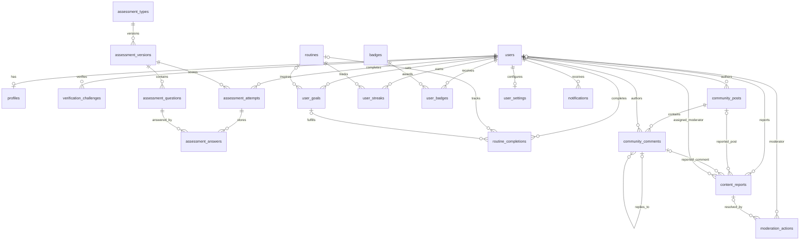

# MindRise Entity Relationship Diagram

```mermaid
erDiagram
  users ||--o| profiles : has
  users ||--o{ verification_challenges : verifies
  users ||--o{ assessment_attempts : completes
  assessment_types ||--o{ assessment_versions : versions
  assessment_versions ||--o{ assessment_questions : contains
  assessment_versions ||--o{ assessment_attempts : scores
  assessment_attempts ||--o{ assessment_answers : stores
  assessment_questions ||--o{ assessment_answers : answered_by
  users ||--o{ user_goals : sets
  routines o|--o{ user_goals : inspires
  users ||--o{ routine_completions : completes
  routines o|--o{ routine_completions : tracks
  user_goals o|--o{ routine_completions : fulfills
  users ||--o{ user_streaks : earns
  routines ||--o{ user_streaks : tracks
  users ||--o{ user_badges : receives
  badges ||--o{ user_badges : awards
  users o|--o{ community_posts : authors
  community_posts ||--o{ community_comments : contains
  users o|--o{ community_comments : authors
  community_comments o|--o{ community_comments : replies_to
  users o|--o{ content_reports : reports
  community_posts o|--o{ content_reports : reported_post
  community_comments o|--o{ content_reports : reported_comment
  users o|--o{ content_reports : assigned_moderator
  users o|--o{ moderation_actions : moderator
  content_reports o|--o{ moderation_actions : resolved_by
  users ||--o| user_settings : configures
  users ||--o{ notifications : receives
```